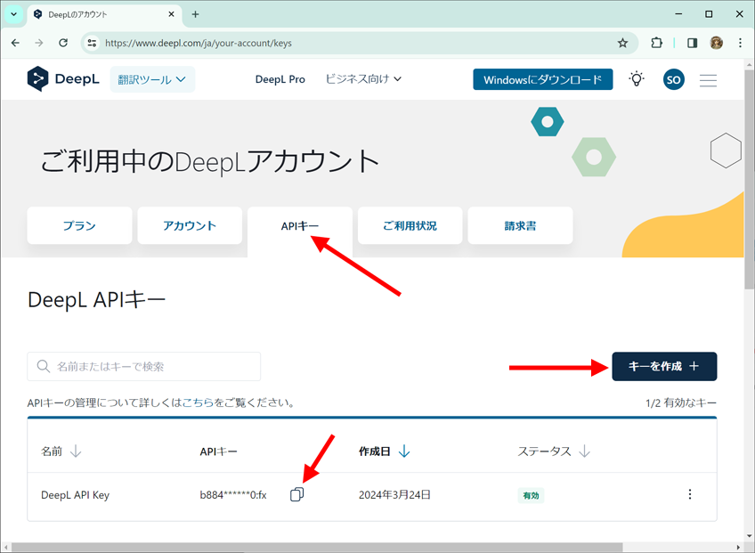
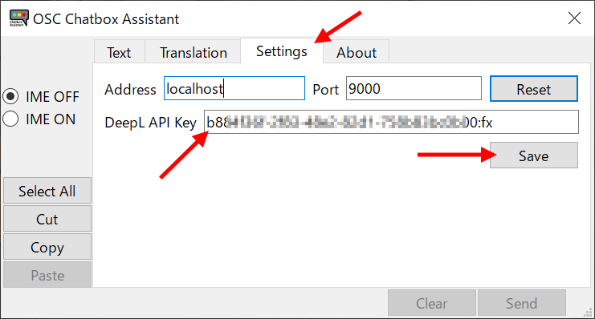

# OSC Chatbox Assistant

## 概要

VRChatのチャットボックスの入力を支援するツールです。

- 日本語入力のオン／オフを切り替えられます。
- 日本語／英語／韓国語／中国語へ相互翻訳できます。
- VR使用時はXSOverlayと組み合わせて使うと便利です。

## インストール

- OSC-ChatboxAssistant.zip を展開し、任意のフォルダへ移動します。

## 起動方法

- OSC-ChatboxAssistant.exe を実行します。
- About画面からショートカットを保存することができます。

## 翻訳機能の準備

- DeepLへログイン

- 初めての場合はアカウントの登録

- 無料プランを選択
- クレジットカード番号を登録（無料プランなので請求はされません）
- アカウントページを開く 

- APIキーを取得

- コピーアイコンをクリック
- OSC Chatbox Assistant の Settings ページで、DeepL API Key の欄で貼り付け（Ctrl+V）
- Saveボタンをクリック

## OSCの有効化

## 使い方

### Textページ

- テキストエリアに文を入力して、Sendボタンを押すとVRChat上のチャットボックスに表示されます。
- Clearボタンでテキストボックスを消去します。
- Pasteボタンでクリップボードのテキストを貼り付けます。

### Translationページ

- 言語一覧から、翻訳先の言語を選択します。
- 上側のテキストエリアに文を入力して、Translateボタンを押すと、翻訳結果が下側のテキストエリアに表示されます。
- Swapボタンで上側と下側の文を交換できます。
- Input into text ボタンを押すと、Textページに切り替わり、翻訳結果の文が挿入されます。

### Settingsページ

- Address : 送信先のホスト名かIPアドレスを指定します。既定値はlocalhostです。
- Port : 送信先のポート番号を指定します。既定値は9000です。
- DeepL API Key : 翻訳機能を利用するためのAPIキーを指定します。

